# CallScope

Live voice agent (**Hermes** reasoning backend) with a telephony-realistic evaluation
harness, call-review workflow, measured improvement loop, and governance artifacts.

**Runtime:** local demo on **Apple Silicon**. ASR / VAD / TTS run natively; the agent LLM
is a hosted open-weight model on **Nebius Token Factory** (optional local fallback).
Showcase = `make demo` + [static site](docs/showcase/index.html) + [video script](docs/showcase/VIDEO.md)
(not a public GPU VM).

| Doc | Link |
|-----|------|
| Design | [`docs/design/CallScope_Phase3_Design.md`](docs/design/CallScope_Phase3_Design.md) |
| Write-up | [`docs/WRITEUP.md`](docs/WRITEUP.md) |
| Demo runbook | [`docs/runbooks/demo.md`](docs/runbooks/demo.md) |
| Decisions | [`docs/DECISIONS.md`](docs/DECISIONS.md) |
| Backlog | [`docs/BACKLOG.md`](docs/BACKLOG.md) |



## Reproduce eval offline (&lt; 10 minutes)

Mocks + LLM **cassettes** only — no Token Factory spend, no livekit required.

```bash
git clone <repo> && cd callscope
make setup                                          # uv, hooks, .env from example
make ci                                             # lint, mypy, pytest, backlog
make eval ARGS='run --mode caller_sim --stack mock' # 16 scenarios, oracle metrics
make load                                           # concurrency 1–2 (T-M6-01)
make security-test                                  # design §8.3 suite
```

Expected: green CI; caller-sim metrics under `artifacts/eval_runs/`; load report under
`docs/reports/load/`.

## Live local demo (interview)

```bash
brew install livekit          # once
make demo                     # Compose + honcho Procfile
open http://127.0.0.1:5173    # consent → WebRTC call
# full steps: docs/runbooks/demo.md
make demo-stop
```

Optional Metal ASR/TTS and Hermes: see the runbook. Live LLM needs `TOKEN_FACTORY_API_KEY`
and stays under `CALLSCOPE_LLM_BUDGET_USD` (`make budget`). Prefer cassette **replay**.

## Architecture (eval loop)



## Third-party data flow

| Destination | May leave the Mac | Stays local |
|---|---|---|
| Token Factory | Fictional prompts / tool calls / eval text | Audio, recordings, real personal voice |
| LangSmith (opt-in) | Scrubbed fictional text only | Audio, real PII |
| Toloka (opt-in stretch) | TEXT labels of fictional utterances | Audio, real personal data |
| Tavily | Not used | — |

## Status

**v1.0.0** — milestones M0–M6 complete (T-M6-04 SIP dropped). See `docs/CHANGELOG.md` and
`docs/sprints/M6-review.md`.
