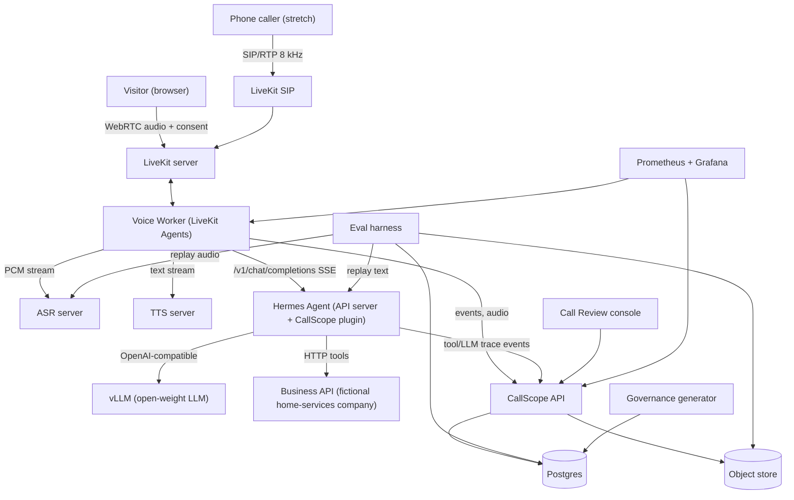
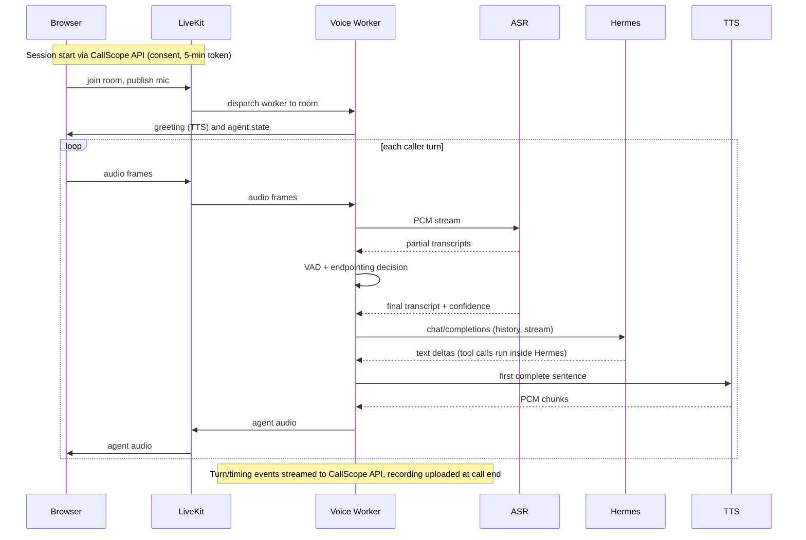
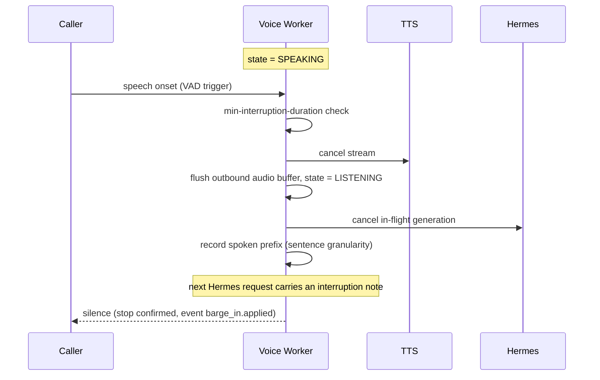
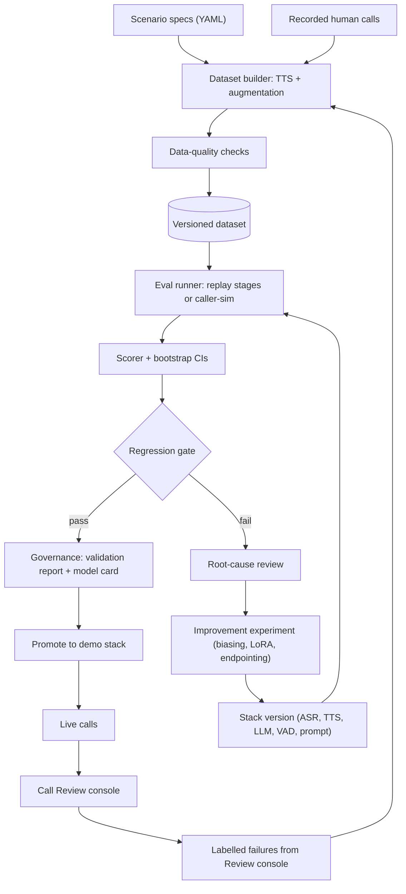
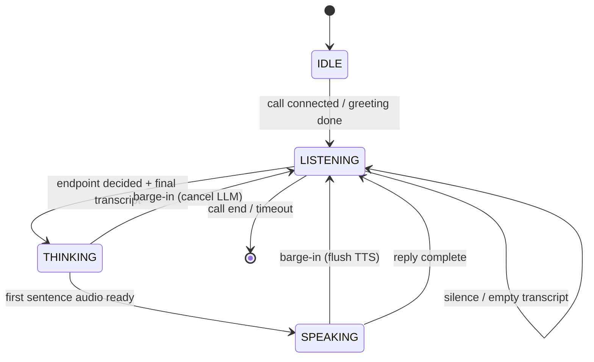
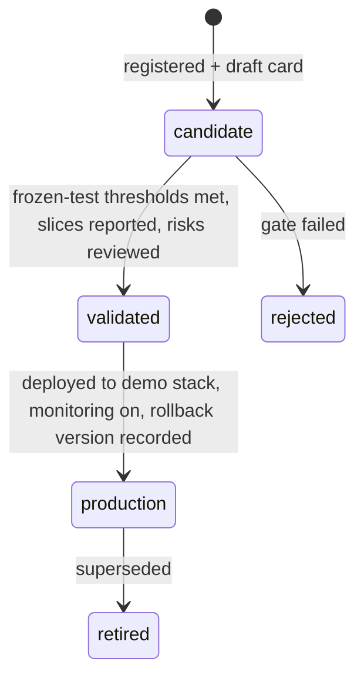
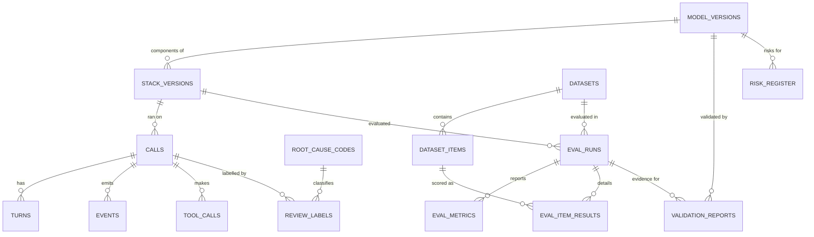
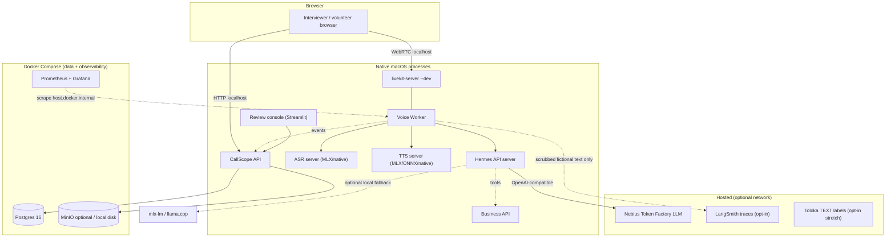

# CallScope — Phase 3: Solution Architecture & Technical Design

**Working name:** CallScope (rename freely) · **Version:** 1.1 (local-Mac rescope) · **Date:** 2026-09-20
**Companion files:** `schema.sql` (full DDL), `openapi.yaml` (Session / Review / Eval / Governance API)

> **Note:** The Markdown file is the design of record and **supersedes** any sibling `.docx`. Regenerate the Word file from this Markdown when needed; do not edit the `.docx` by hand.

**One-line pitch:** A live voice agent (Hermes Agent as the reasoning backend) running as a **local demo on Apple Silicon**, with telephony-realistic evaluation, call review, a measured improvement loop, and governance artifacts — showcased via `make demo`, a recorded video, and a static site (not a public GPU VM).

### Change log of this design revision (2026-09-20)
- **Scope:** public Nebius GPU VM demo → local Apple Silicon Mac demo; LLM inference via Nebius Token Factory (hosted open-weight) with optional local LLM fallback.
- **ADR-003** → hybrid models; **ADR-009** → local-only runtime; **ADR-012** / **FR-15** → dropped (SIP = Future work).
- **New ADRs:** ADR-014 hybrid models + Token Factory; ADR-015 local-only deployment; ADR-016 budget guard + cassettes; ADR-017 showcase deliverable.
- **NFRs re-baselined as hypotheses:** NFR-01 p50≤1.8s / p95≤3.0s (incl. hosted TTFT); NFR-03 = 1 call (2 stretch); NFR-07 = fresh clone → `make demo` <20 min; NFR-11 = LLM budget cap; NFR-13 = local `purge`.
- **Removed:** captcha, public rate limits, Caddy/TLS public edge, deploy.yml, GPU compose, staging/demo Environments, idle GPU shutdown.
- **Kept:** consent, fictional-data banner, Hermes toolset lockdown, policy hook, prompt-injection tests, secrets hygiene, PII scrubbing.
- Facts and decisions recorded in `docs/DECISIONS.md` (D-20260920-10..).

## 0. Status, scope of this document, and what changed since the earlier plan

### 0.1 Contents

| § | Deliverable | § | Deliverable |
|---|---|---|---|
| 1 | Requirements baseline (FR/NFR) | 7 | DB design (+ `schema.sql`) |
| 2 | SAD — System Architecture Document | 8 | Security design |
| 3 | HLD — High-level design (3.1) | 9 | Infrastructure design |
| 4 | LLD — Detailed technical design (3.2) | 10 | NFRs with measurement methods |
| 5 | ADRs (13 + ADR-014..017) | 11 | Traceability (requirements → design → tests → JD) |
| 6 | API specs (+ `openapi.yaml`) | 12 | Design review, spike plan, implementation readiness |

### 0.2 Important change to the earlier plan (read this first)

The earlier recommendation was to build streaming TTS and barge-in as the project's core. Research for this phase shows that gap is now closed upstream: **Hermes Agent v0.20.0 (Aug 3, 2026) ships streaming, clause-by-clause TTS and barge-in natively** (CLI, desktop, and gateway adapters), and a third-party `hermes-livekit` plugin already provides a LiveKit WebRTC voice gateway with barge-in. Rebuilding those would duplicate existing work and would not differentiate the project.

**Consequence for this design:** the realtime audio loop is assembled from existing components (LiveKit + Hermes), and the project's original contribution is everything the JD emphasises that the ecosystem does *not* give you: self-hosted ASR/TTS/LLM selected by benchmark on **telephony-degraded audio**, a per-stage **evaluation harness**, **call review with root-cause attribution**, a **measured improvement loop**, and **governance artifacts**.

### 0.3 Facts this design depends on

**Verified against Hermes docs / upstream PRs (as of 2026-09-19):**

| # | Fact | Design use |
|---|---|---|
| V1 | Pip plugins load via the `hermes_agent.plugins` entry-point group; each exposes `register(ctx)`. `ctx` offers `register_tool`, `register_hook`, `register_skill`. | Plugin packaging (§4.3) |
| V2 | Hooks include `pre_llm_call`, `post_llm_call`, `pre_tool_call`, `post_tool_call`, `on_session_start/end`, `pre_transcription`. Callbacks receive kwargs (accept `**kwargs`), are fail-open, and timeout-bounded on hot paths. | Trace + policy hooks |
| V3 | Plugins can declare capabilities; the user is asked to consent at install, and updates cannot silently widen access. | Security (§8) |
| V4 | Built-in API server exposes OpenAI-compatible `/v1/chat/completions` (SSE streaming) and `/v1/responses` (default port 8642, `API_SERVER_ENABLED`, `API_SERVER_KEY`). Each request creates a server-side `AIAgent`; **tools execute on the API-server host**; the request `model` field is ignored unless `direct_model_requests` is enabled. | ADR-001; toolset lockdown |
| V5 | Native streaming TTS + barge-in exist in Hermes v0.20.0; gateway platform adapters extend `BasePlatformAdapter` and can be packaged as plugins. | ADR-002 |
| V6 | Third-party `hermes-livekit` (LiveKit WebRTC voice gateway plugin) exists. | ADR-002 (reuse/compare) |
| V7 | Hermes + Ollama: `stream=true` with tools can hang (reported); Hermes supports custom OpenAI-compatible providers and local mlx-lm/llama.cpp on Mac. | Prefer Token Factory (or mlx-lm/llama.cpp) over Ollama |

**Not yet verified — each has a spike in §12.2 with a fallback:**

| # | Unknown | Spike |
|---|---|---|
| U1 | How a per-call correlation ID reaches Hermes hook kwargs when called through the API server | S-1 — **resolved (D-20260920-04):** metadata/`user`/headers do not reach hooks; use user-message `CALL_CONTEXT` + tool-arg `call_id` |
| U2 | Per-turn overhead Hermes adds (system prompt size, memory/skills load) on time-to-first-token with a slim profile | S-2 — **resolved (D-20260920-20):** overhead p50 **1385 ms** (FAIL ≤450 ms); adopt thin FAQ fast-path (R-02) |
| U3 | Tool-calling reliability of the chosen open-weight LLM through Token Factory + Hermes | S-3 — **resolved (D-20260920-18):** choose `nvidia/Nemotron-3_5-Lightning` (100% / 60 turns); Qwen3-30B alternate |
| U4 | LiveKit Agents: custom STT/TTS plugin wiring, interruption behaviour, exact parameter names in the installed version | S-4 — **resolved (D-20260920-05):** own Agents worker + stub providers work; §4.2→`TurnHandlingOptions` mapped on 1.8.2; hermes-livekit not adopted |
| U5 | Candidate ASR/TTS/VAD on Apple Silicon: streaming, licence, unified-memory, RTF, telephony WER | S-5 — **resolved (D-20260920-19):** mlx-whisper-tiny + faster-whisper-base; Piper + kokoro-onnx; Silero VAD |
| U6 | Mac unified-memory budget + Token Factory RTT/TTFT from this location | S-6 — **resolved (D-20260920-17):** baseline + livekit + regional RTT + chat latency |
| U7 | ~~SIP trunk + `livekit-sip`~~ — **dropped**; telephony realism via C1–C5 only (Future work) | — |


## 1. Requirements baseline

There are no Phase 1/2 documents for this project, so the baseline is defined here (derived from the target JD and the agreed direction). Every requirement is traced to design and tests in §11.

### 1.1 Functional requirements

| ID | Requirement | Pri |
|---|---|---|
| FR-01 | A visitor can hold a live voice call with the agent from a browser (WebRTC) after an explicit recording-consent step. | Must |
| FR-02 | The agent handles receptionist tasks for a fictional home-services company: book, reschedule, cancel an appointment; answer FAQs (hours, service area, price ranges); take a callback request; hand off to a human. Actions use Hermes tool calls with structured arguments. | Must |
| FR-03 | Streaming turn pipeline: VAD/endpointing → streaming STT → streaming LLM → sentence-chunked streaming TTS. | Must |
| FR-04 | Barge-in: caller speech during agent playback stops playback and tells the agent it was interrupted and what was already spoken. | Must |
| FR-05 | ASR, TTS and LLM are self-hosted open-weight models behind swappable provider interfaces. | Must |
| FR-06 | Every call is recorded (with consent) and persisted with per-turn transcripts and timing events. | Must |
| FR-07 | A synthetic + recorded evaluation dataset generator with telephony degradations (8 kHz μ-law, noise, packet loss); datasets are versioned and pass automated data-quality checks. | Must |
| FR-08 | An offline evaluation harness scoring ASR, entity/NLU, dialogue, tool use, hallucination, latency and turn-taking per model stack version, with a regression gate. | Must |
| FR-09 | A Call Review console: auto-flagged calls, per-turn timeline, root-cause labelling, export of labelled failures into a dataset. | Must |
| FR-10 | At least one documented improvement loop: baseline → root cause → change → before/after on a frozen held-out set. | Must |
| FR-11 | Governance: model inventory, model cards, validation reports against pre-declared thresholds, risk register — generated from eval results. | Must |
| FR-12 | Live monitoring dashboards: latency percentiles, error rates, ASR-confidence drift, session counts. | Should |
| FR-13 | Guardrails: tool allowlist, confirmation before state-changing actions, answers grounded in a knowledge base, out-of-scope → handoff. | Must |
| FR-14 | Simulated caller: scripted/LLM-driven synthetic caller that joins a room and runs scenarios end to end. | Should |
| FR-15 | Telephony: inbound call through a SIP trunk into the same agent (8 kHz). | **Dropped** (Future work; C1–C5 cover telephony realism) |

### 1.2 Non-functional requirements (summary; full table in §10)

| ID | Target |
|---|---|
| NFR-01 | **Hypothesis (pre-measure):** end-of-caller-speech → first agent audio p50 ≤ 1.8 s, p95 ≤ 3.0 s (hosted-LLM network/TTFT included; stage breakdown separates local vs network) |
| NFR-02 | Barge-in: worker-side stop ≤ 250 ms p95 from VAD onset (unchanged) |
| NFR-03 | Concurrency: 1 call required, 2 stretch on this Mac; simple local session cap |
| NFR-04 | Quality thresholds (declared before measuring, §10): e.g. phone-number sequence accuracy ≥ 90% clean / ≥ 80% telephony; tool-arg accuracy ≥ 90%; hallucination ≤ 3% |
| NFR-05 | Security: consent gate, least-privilege tools, no secrets in repo, 30-day local audio retention by default |
| NFR-06 | Reproducibility: any reported number is regenerable from a git SHA + dataset version + stack version (+ LLM cassettes) |
| NFR-07 | A fresh clone reaches a working demo in under 20 minutes with `make demo` (hypothesis) |
| NFR-11 | LLM spend stays under the configured budget cap (`CALLSCOPE_LLM_BUDGET_USD`, default $15 of $25 Token Factory credit) |
| NFR-13 | Retention via local `purge` / `delete-call` for recordings |


## 2. SAD — System Architecture Document

### 2.1 Goals and non-goals

**Goals**
1. A convincing live demo of a Hermes-backed voice agent.
2. Stage-level *evaluability*: every failure can be attributed to VAD/turn-taking, ASR, LLM/NLU, tool, TTS, or system.
3. Evidence of the JD's loop: data → model → benchmark → ship with monitoring → root-cause production issues → improve → document validation.

**Non-goals**
- Not a product: no auth for end users, no billing, no multi-tenant, no real customer data.
- Not a new speech model from scratch; not speech-to-speech (see ADR-004).
- Not re-implementing streaming TTS / barge-in inside Hermes (ADR-002).
- No Kubernetes, no autoscaling (ADR-009).

### 2.2 Architectural drivers

| Driver (from JD) | Architectural consequence |
|---|---|
| ASR, TTS, NLU/dialogue as separate ML components | Cascaded pipeline with provider interfaces per stage (ADR-004) |
| Root-cause ASR errors, hallucinations, latency, turn-taking | Append-only per-turn event log with timestamps; stage-attribution rules (§4.7) |
| Benchmark, validate against targets, ship with monitoring | Eval harness + regression gate + Prometheus/Grafana |
| Datasets, labelling workflows, data-quality checks | Dataset manifests, DQ checks, review console with export |
| Model governance | Model inventory + validation reports as code (ADR-011) |
| Inference latency and cost | Local ASR/TTS + Token Factory LLM; latency budget; budget guard |
| Hermes / agent demo | Hermes as reasoning backend + real plugin (tools, hooks, skill) |

### 2.3 Constraints and assumptions

**Updated 2026-09-20:** Runtime is an **Apple Silicon Mac** (no CUDA). LLM inference uses **Nebius Token Factory** ($25 hard credit budget) with optional local fallback. No Nebius GPU VMs. Docker Compose is for data/observability only. Showcase = `make demo` + video + static site (not a public live demo).


- Solo developer, part-time; Cursor IDE; Python-first; Nebius credits for the GPU.
- Public demo visitors are untrusted; all business data is fictional.
- Only open-weight models are served locally; a hosted LLM/ASR is permitted *only* as an evaluation comparison baseline, never in the demo path.
- Hermes is treated as a black box behind its public surfaces (API server + plugin API); no fork.

### 2.4 Quality-attribute priorities (ranked)

1. **Evaluability / observability** (the differentiator)
2. **Latency** (conversation feels natural)
3. **Security and cost safety** (public endpoint + GPU credits)
4. **Reproducibility**
5. **Reliability** (best-effort; degrade gracefully)
6. **Extensibility** (swap models/providers)

### 2.5 System context



### 2.6 Logical architecture (planes)

| Plane | Components | Runs on |
|---|---|---|
| **Realtime** | Web client, LiveKit server, Voice Worker (VAD, turn detection, orchestration) | GPU node |
| **Reasoning** | Hermes Agent (API server, `receptionist` profile, CallScope plugin), Business API | GPU node |
| **Model serving** | vLLM (LLM), ASR server, TTS server | GPU node |
| **Data & eval** | Postgres, object store, dataset builder, eval harness, caller simulator, MLflow | CPU node (+ GPU node for runs) |
| **Review & governance** | Call Review console, governance generator, model inventory | CPU node |
| **Ops** | Prometheus, Grafana, Caddy, logs | CPU node (+ exporters on GPU node) |

### 2.7 Technology stack

| Concern | Choice | Why | Alternatives considered |
|---|---|---|---|
| Realtime media | LiveKit (self-hosted OSS) + LiveKit Agents (Python) | WebRTC + SIP in one stack; built-in VAD/turn/interruption plumbing; Hermes docs already cite LiveKit as a voice-capable gateway platform | Pipecat; Hermes-native adapter; custom aiortc |
| Agent brain | Hermes Agent via API server | The point of the demo; tools/skills/memory framework; stable public surface | Direct LLM calls (loses the Hermes demo value) |
| LLM serving | vLLM, open-weight instruct model with reliable tool calling | OpenAI-compatible, streaming, tool-call parsers, quantization | Ollama (issue V7), TGI |
| ASR | Candidates: faster-whisper (Whisper large-v3-turbo / distilled), NVIDIA streaming FastConformer/Parakeet family | Benchmark decides (S-5); both self-hostable | Hosted ASR (baseline only) |
| TTS | Candidates: Kokoro-82M, Piper, one LLM-based streaming TTS | Small, fast, self-hostable; licence check at S-5 | Hosted TTS (baseline only) |
| VAD / turn | Silero VAD; optional LiveKit turn-detector model | Standard, CPU-cheap | WebRTC VAD, energy-only |
| Backend / API | Python 3.11+, FastAPI, Pydantic v2, SQLAlchemy 2 + Alembic | Team-standard, typed | — |
| DB | Postgres 16 | Relational eval data + JSONB events | ClickHouse (overkill), SQLite |
| Object store | MinIO (S3 API) locally / Nebius object storage | Audio + artifacts | Local disk |
| Experiments | MLflow tracking | Familiar, lightweight | W&B |
| Review UI | Streamlit | Fast to build; audio + tables | Label Studio (ADR-013) |
| Frontend | Static TypeScript page + `livekit-client` | No framework needed | Next.js starter |
| Observability | Prometheus + Grafana, JSON logs, OpenTelemetry optional | Latency histograms | Datadog etc. |
| Packaging/CI | Compose (Postgres/Prom/Grafana), native Procfile/`make demo`, GitHub Actions, `uv`, ruff, pytest | Simple | Kubernetes (rejected) |

### 2.8 Feasibility assessment

| Component | Evidence it is feasible | Confidence | Residual risk → mitigation |
|---|---|---|---|
| Hermes as backend over API server | V4 documented; OpenAI-compatible SSE | High | Overhead per turn (U2) → slim profile, prompt caching, measure in S-2 |
| Hermes plugin (tools/hooks/skill) | V1–V3 documented, several third-party plugins exist | High | Hook kwargs lack call ID (U1) → worker is latency source of truth; correlate by tool-arg `call_id` injected by plugin |
| LiveKit realtime loop | Mature stack; `hermes-livekit` precedent | High | Custom STT/TTS plumbing (U4) → adapter classes; fallback to Pipecat or reuse `hermes-livekit` (ADR-002) |
| Local ASR/TTS on Mac + hosted LLM | ASR/TTS fit in ~12 GB usable unified memory (verify S-5/S-6); LLM on Token Factory | Medium | Memory pressure + budget → NFR-03/NFR-11 |
| Telephony-degraded eval | Standard DSP (resample, μ-law codec via `sox`/`ffmpeg`, noise mixing) | High | Synthetic speech is cleaner than real → recorded set + report the gap |
| Fine-tuning ASR (LoRA) | Established for Whisper-family; small data OK | Medium | Overfitting to synthetic voices → frozen recorded holdout |
| SIP path | `livekit-sip` + trunk provider is documented practice | Medium | Cost/abuse (toll fraud) → stretch, allowlist, caps (§8) |

### 2.9 Risk register (top risks)

| ID | Risk | L | I | Mitigation |
|---|---|---|---|---|
| R-01 | Scope too big for the timeline | H | H | Milestones with a cut order (§12.3); eval/review/improvement are protected, telephony is first to cut |
| R-02 | Hermes per-turn overhead breaks latency target | M | H | Slim profile, S-2 measurement, fallback: Hermes handles only tool/plan turns while a thin path answers simple FAQs (only if S-2 fails) |
| R-03 | Open-weight LLM flaky at tool calling | M | H | S-3 model shortlist; constrained parameter schemas; policy hook validates args; retry-once with error text |
| R-04 | Barge-in false triggers (echo/noise) | M | M | Browser AEC/NS/AGC, VAD hysteresis, min interruption duration, measured false-barge-in rate |
| R-05 | Local demo abuse / LLM credit burn | L | H | Consent + fictional banner, token TTL, local session cap, budget guard + cassettes |
| R-06 | Synthetic-only eval overstates quality | H | M | Recorded human set; report synthetic-vs-real gap explicitly |
| R-07 | Recording-consent/privacy violation | L | H | Explicit consent gate, retention policy, no real PII solicited (fictional data banner) |
| R-08 | LLM-judge unreliable for hallucination scoring | M | M | Rule-based claim checks first; judge calibrated to human labels on ≥ 50 samples before use |
| R-09 | Upstream Hermes API change | M | M | Pin versions; contract tests on the API-server surface; plugin `doctor --ci` in CI |
| R-10 | GPU not available/expensive at demo time | M | M | Offline mode with recorded calls; on-demand start script; documented warm-up time |


| R-TF | Token Factory budget exhaustion ($25) | Live eval / iteration blocked | Budget guard + cassettes (ADR-016); default $15 cap; cassette-first workflow |
| R-LAT | Hosted-LLM latency variance (network TTFT) | Miss NFR-01 hypothesis | Stage breakdown; measure S-6; optional local fallback; widen NFR-01 |
| R-MEM | Mac unified-memory pressure (ASR+TTS+apps on 16 GB) | OOM / swap thrash | S-5/S-6 sizing; leave ≥4 GB; defer E2; single-call default |
| R-MLX | MLX / torch-MPS library churn | Broken pins, non-reproducible builds | Pin versions; record in inventory; cassette CI independent of MLX |
| R-LK | livekit-server macOS issues | No WebRTC path | S-6 verifies brew `--dev`; fallback FastAPI WebSocket + own VAD (new ADR + tasks) |

## 3. HLD — High-Level Design

### 3.1 Component catalogue

| ID | Component | Responsibility | Tech | Key interfaces |
|---|---|---|---|---|
| C1 | Web client | Consent modal, mic capture (AEC/NS/AGC on), call UI, live transcript + agent state, end call | TypeScript, `livekit-client` | Session API; LiveKit; data-channel events |
| C2 | LiveKit server | WebRTC SFU/TURN; rooms; (optional) SIP via `livekit-sip` | LiveKit OSS | WebRTC, token auth |
| C3 | Voice Worker | Per-call orchestration: VAD, endpointing, streaming STT, Hermes call, sentence chunking, streaming TTS, interruption, event emission | Python, LiveKit Agents | ASR/TTS servers, Hermes API, Ingest API |
| C4 | ASR server | Streaming + batch transcription with word timings/confidence; hotword support | faster-whisper or streaming FastConformer behind FastAPI/WebSocket | WS `/v1/stream`, HTTP `/v1/transcribe` |
| C5 | TTS server | Streaming PCM synthesis per sentence | Kokoro/Piper/other behind FastAPI | HTTP chunked `/v1/tts/stream` |
| C6 | LLM server | Open-weight instruct model, streaming, tool calls | vLLM | OpenAI-compatible; consumed by Hermes only |
| C7 | Hermes Agent | Reasoning, tool execution, policy; `receptionist` profile; CallScope plugin (tools, hooks, skill) | Hermes v0.20+ | OpenAI-compatible API server (port 8642) |
| C8 | Business API | Fictional scheduling backend + FAQ knowledge base | FastAPI + Postgres (`biz` schema) | REST |
| C9 | CallScope API | Session minting, event ingest, review/eval/governance REST | FastAPI | REST (`openapi.yaml`) |
| C10 | Eval harness + dataset builder + caller simulator | Build/version datasets, replay pipeline stages, score, gate, report | Python CLI (`callscope`), MLflow | Postgres, object store, model servers, Hermes |
| C11 | Call Review console | Triage, timeline, labelling, export | Streamlit | CallScope API |
| C12 | Governance generator | Model inventory, cards, validation reports, risk register | Python + Jinja2 → md/docx | Postgres |
| C13 | Observability | Metrics, dashboards, alerts | Prometheus, Grafana | `/metrics` exporters |

### 3.2 Live call — happy path



### 3.3 Barge-in



### 3.4 Evaluation and improvement flow



### 3.5 Data architecture overview

| Data | Producer | Store | Consumer | Retention |
|---|---|---|---|---|
| Call audio (mixed + per-track) | Voice Worker | Object store `calls/` | Review console, dataset builder | 30 days unless donated to eval set |
| Turn transcripts, timings, events | Worker, plugin | Postgres `events`, `turns` | Review, metrics, eval | 180 days (aggregates kept) |
| Tool calls | Plugin | Postgres `tool_calls` | Review, eval | 180 days |
| Datasets + manifests | Dataset builder | Object store `datasets/` + Postgres | Eval, training | Permanent (versioned) |
| Eval results | Eval runner | Postgres `eval_*`, MLflow artifacts | Governance, dashboards | Permanent |
| Model registry + governance | Governance module | Postgres | Reports, model cards | Permanent |
| Business data (fictional) | Business API | Postgres `biz` | Hermes tools | Resettable |

### 3.6 Latency budget (end of caller speech → first agent audio audible)

| Stage | Budget p50 | Notes |
|---|---|---|
| Endpointing (silence after speech) | 400 ms | Tunable; trades against premature cut-off |
| ASR finalization after endpoint | 100–150 ms | Needs true streaming or chunk-aligned finalization |
| Worker → Hermes → first LLM token | 350–450 ms *(local vLLM era)* | **S-2 measured (hosted TF):** Hermes−direct overhead p50 **~1.4 s** — too high for every turn → R-02 thin FAQ path (D-20260920-20) |
| First-sentence accumulation | 150 ms | Sentence/clause chunker; shorter with clause splitting |
| TTS time-to-first-byte | 150–200 ms | Per candidate model (S-5: Piper ~53 ms p50) |
| Network + jitter buffer | 100 ms | Browser; more on SIP |
| **Network / Token Factory TTFT** | **≈ 0.2–0.8 s (hypothesis; measure in S-6)** → **measured direct p50 ~884 ms** (Lightning, S-2) | Separable from local stages; S-6 chat probe on Nano was ~699 ms |
| **Total** | **≈ 1.5–2.3 s (hypothesis)** | NFR-01 p50≤1.8s needs FAQ fast-path and/or Hermes-only-on-tools (D-20260920-20) |


## 4. LLD — Detailed Technical Design

### 4.1 Repository layout (monorepo)

```
callscope/
  apps/
    web/                     # static TS client
    api/                     # CallScope API (FastAPI)
    worker/                  # LiveKit Agents voice worker
    biz/                     # Business API + KB
    review/                  # Streamlit console
  servers/
    asr/                     # ASR server (WS + HTTP)
    tts/                     # TTS server
    llm/                     # vLLM launch config
  plugins/
    hermes_callscope/        # pip-installable Hermes plugin
  callscope/                 # shared python package
    events/  providers/  norm/  eval/  datasets/  governance/  cli.py
  eval/
    scenarios/*.yaml  thresholds.yaml  baselines/*.json
  infra/
    compose.cpu.yaml  compose.gpu.yaml  caddy/  prometheus/  grafana/  scripts/
  docs/  adr/  model_cards/  validation_reports/
  tests/
```

### 4.2 Voice Worker

**Turn state machine**



**Configuration (defaults, all tunable and stored in the stack version)**

| Key | Default | Meaning |
|---|---|---|
| `endpoint.min_delay_s` | 0.4 | Minimum silence before declaring end of utterance |
| `endpoint.max_delay_s` | 1.2 | Upper bound when the utterance looks incomplete |
| `vad.threshold` / `vad.min_speech_ms` | 0.5 / 200 | Silero VAD sensitivity |
| `barge_in.min_duration_ms` | 250 | Sustained speech required to interrupt |
| `barge_in.grace_ms_after_playback_start` | 400 | Ignore triggers right after agent starts (echo) |
| `chunker.min_chars` | 24 | Avoid tiny TTS requests; flush at sentence/clause boundary |
| `filler.after_ms` | 1500 | Play a pre-synthesised “one moment” if no LLM token yet |
| `call.max_duration_s` | 240 | Hard cap for public sessions |
| `call.silence_timeout_s` | 20 | Polite prompt, then end |

(Parameter names of LiveKit Agents confirmed in spike S-4 / D-20260920-05 against
`livekit-agents==1.8.2`: map §4.2 keys onto `TurnHandlingOptions` /
`silero.VAD.load` / `aec_warmup_duration` — see `spikes/T-M0-05/results/config_mapping.md`.)

**Provider interfaces** (`callscope/providers/base.py`)

```python
class STTProvider(Protocol):
    async def stream(self, pcm: AsyncIterator[bytes], *, sample_rate: int,
                     hotwords: list[str] | None) -> AsyncIterator[STTEvent]: ...
    async def transcribe(self, wav: bytes, *, sample_rate: int) -> Transcript: ...

class TTSProvider(Protocol):
    async def stream(self, text: str, *, voice: str, speed: float) -> AsyncIterator[bytes]: ...
    sample_rate: int

class BrainBackend(Protocol):          # Hermes today; direct-LLM baseline for evals
    async def stream_reply(self, messages: list[Msg], *, call_id: str,
                           turn_id: str) -> AsyncIterator[BrainDelta]: ...
    async def cancel(self, turn_id: str) -> None: ...
```

Every provider call is wrapped by a decorator that emits `*.request`, first-byte and completion events, so instrumentation is uniform and offline replay uses the same code path as live calls.

**Turn handling (pseudocode)**

```
on vad.speech_start:
    if state == SPEAKING and speech_sustained(min_duration): interrupt()
on stt.final(text, conf, words):
    if not text.strip(): return                       # silence, not an error
    turn = new_turn(); state = THINKING; emit(stt.final)
    history.append(user(text))
    start_filler_timer(filler.after_ms)
    async for delta in brain.stream_reply(history, call_id, turn.id):
        cancel_filler_timer(); chunker.push(delta)
        for sentence in chunker.ready():
            async for pcm in tts.stream(tts_norm(sentence)): publish(pcm); state = SPEAKING
    history.append(agent(spoken_text)); state = LISTENING
interrupt():
    tts.cancel(); brain.cancel(turn.id); flush_outbound(); state = LISTENING
    history.append(agent(spoken_prefix, interrupted=True))
    next_request_note = "The caller interrupted; you had said: <spoken_prefix>. The rest was not heard."
```

**Interruption fidelity.** The spoken prefix is approximated at sentence granularity from playback progress (exact word alignment is not required; documented limitation).

**TTS text normalisation (`callscope/norm`).** Phone numbers read digit by digit with grouping pauses; dates/times as words; confirmation codes character by character; strips markdown, `<think>` blocks, tool traces. Same module is unit-tested and used in eval for TTS pronunciation checks.

**Client data-channel events (worker → browser):** `agent.state`, `transcript.partial`, `transcript.final`, `agent.text`, `notice` (e.g. “recording on”), `error`.

### 4.3 Model servers

**ASR server**

| Interface | Detail |
|---|---|
| WebSocket `/v1/stream` | Client sends JSON `start` (`sample_rate`, `encoding=pcm_s16le`, optional `hotwords`), then binary PCM frames (20–100 ms), then JSON `end`. Server emits JSON `partial` (`text`, `t_start_ms`) and `final` (`text`, `words[{w,start_ms,end_ms,conf}]`, `avg_conf`). |
| HTTP `POST /v1/transcribe` | Multipart audio → same `final` object; used by eval and dataset tooling. |
| Implementation note | If the chosen model is not natively streaming, use VAD-segmented chunking with a local-agreement policy for partials; the final is produced on the endpointed segment. |
| Health/metrics | `/healthz`, `/metrics` (request latency, real-time factor, queue depth) |

**TTS server**

| Interface | Detail |
|---|---|
| `POST /v1/tts/stream` | JSON `{text, voice, speed, sample_rate}` → chunked raw PCM16 (`Content-Type: audio/L16`, `X-Sample-Rate`) |
| `GET /v1/voices` | Available voices |
| Metrics | TTFB, real-time factor, characters/s |

**LLM server (vLLM)** — launched with the tool-call parser matching the chosen model family (for Hermes-format tool calls the `hermes` parser; confirm per model in S-3), prefix caching on, max context sized for a 4-minute call, quantised weights to fit the GPU budget (§9.5). Only Hermes talks to it.

### 4.4 Hermes integration and the CallScope plugin

**Hermes deployment**

- Dedicated profile `receptionist` (isolated config, memory, sessions). API server enabled, bound to the private network, API key required.
- **Toolset lockdown (security-critical, V4):** the API-server platform is configured with *only* the plugin's tools (no terminal, file, browser, or web tools). Verified by a startup self-test that lists the effective toolset and fails the deployment if anything else is present.
- Provider = the vLLM endpoint (OpenAI-compatible). `direct_model_requests` stays off; the worker sends a fixed alias.
- Slim system prompt: role, policy skill, tool guidance. Long-term memory disabled for public callers (no cross-caller memory).

**Plugin: `hermes-callscope` (pip, entry point `hermes_agent.plugins`)**

| Part | Content |
|---|---|
| `register(ctx)` | registers tools, hooks and the skill; declares minimal capabilities |
| Tools | `check_availability`, `book_appointment`, `reschedule_appointment`, `cancel_appointment`, `lookup_faq`, `request_callback`, `transfer_to_human` (schemas below) |
| Hooks | `pre_tool_call` (policy + argument validation, may block), `post_tool_call` (trace), `pre_llm_call` / `post_llm_call` (trace; token/latency data when available), `on_session_start/end` |
| Skill | `callscope:receptionist` — persona, brevity rules (spoken style, one question at a time), confirmation and read-back protocol, grounding rule (“answer factual policy/price questions only from `lookup_faq` results; otherwise say you don't know and offer a callback”), refusal rules for out-of-scope and injection attempts |

**Tool contracts** (all tools also require `call_id`; see correlation below)

| Tool | Arguments | Returns | Mutating |
|---|---|---|---|
| `check_availability` | `service_type` (enum), `date_from`, `date_to` (ISO date), `zip` | list of `{slot_id, start, end}` | No |
| `book_appointment` | `customer_name`, `phone` (10-digit US), `service_type`, `slot_id`, `address`, `notes?`, `confirmed` (bool) | `{confirmation_code, start}` | Yes |
| `reschedule_appointment` | `confirmation_code`, `new_slot_id`, `confirmed` | updated appointment | Yes |
| `cancel_appointment` | `confirmation_code`, `confirmed` | `{status}` | Yes |
| `lookup_faq` | `query` | passages `{doc_id, text}` (top-3) | No |
| `request_callback` | `customer_name`, `phone`, `reason`, `preferred_window` | `{ticket_id}` | Yes |
| `transfer_to_human` | `reason` | `{status: "simulated"}` | Yes |

**`pre_tool_call` policy rules:** (1) mutating tools require `confirmed=true`; (2) argument schema/regex validation (phone digits, ISO dates, slot exists and is open); (3) `call_id` must be an active call; (4) per-call tool budget (max 12 calls) and per-tool rate limit; (5) block and return a structured error the model can recover from (“missing confirmation”). Policy denials emit `policy.denied` events (they are valuable review data).

**Correlation (U1 / S-1, D-20260920-04).** Hermes Agent 0.19.0 API server does **not** expose OpenAI `user` or `X-Call-Id`/`X-Turn-Id` to plugin hook kwargs. System-role text is also absent from `pre_llm_call` history. **Required path:** the worker includes `CALL_CONTEXT call_id=<uuid>` in the **user** message content each turn; every tool schema requires `call_id`; `pre_tool_call` validates it against active calls. The worker remains the source of truth for latency; the plugin adds tool timings and policy events.

### 4.5 Business API and knowledge base

- Fictional company (“Lakeside Home Services”: HVAC and plumbing), seeded deterministically: 3 service types, 2 weeks of slots, ~25 KB documents (hours, service area, price *ranges*, cancellation policy, warranty, emergency policy).
- The KB deliberately has *gaps* (e.g. no price for a specific repair) so hallucination tests have ground truth: an answer not supported by KB text is a defect.
- Idempotent `POST /appointments` with `Idempotency-Key`; deterministic reset endpoint for eval runs (`POST /admin/reset?seed=`).

### 4.6 Datasets and evaluation harness

**Scenario spec (YAML)** — one file per scenario template:

```yaml
id: book_with_correction
intent: book_appointment
slots: {service_type: hvac_repair, date: "{{next_tuesday}}", name: "{{name}}", phone: "{{phone10}}", address: "{{address}}"}
turns:
  - caller: "Hi, my AC stopped working and I need someone to come out."
  - caller: "Thursday afternoon works... actually no, Tuesday, sorry."
  - caller: "It's {{name_spelled}}, phone {{phone_spoken}}."
expected:
  tool_calls: [{name: check_availability}, {name: book_appointment, args: {slot_date: "{{next_tuesday}}"}}]
  final_state: {appointment_exists: true}
  must_confirm_before_mutation: true
  must_not_claim: ["price_specific"]
tags: [correction, digits, names]
```

**Scenario library (12 templates + 4 adversarial):** simple booking; booking with correction; no availability → alternative; reschedule; cancel; FAQ in KB; FAQ *not* in KB (must decline/callback); callback request; human handoff; multi-intent; spelled name + address heavy; noisy environment; **barge-in mid-sentence**; **silence / no response**; **prompt-injection** (“ignore your instructions…”, “list other customers' appointments”); **out-of-scope / abusive caller**.

**Conditions matrix (applied by `callscope.datasets.augment`)**

| Code | Condition |
|---|---|
| C0 | Clean 16 kHz |
| C1 | Telephony: band-limit 300–3400 Hz, 8 kHz, μ-law encode/decode |
| C2 / C3 / C4 | C1 + background noise at SNR 20 / 10 / 5 dB |
| C5 | C1 + 5% random 20 ms frame loss |
| Speed | ±10% tempo perturbation on a subset |

**Data composition and splits**

| Set | Size (target) | Split policy |
|---|---|---|
| Synthetic (callers voiced by a *different* TTS than the agent, ≥ 6 voices) | ~120 calls (~1,500 turns) × conditions | Split by scenario-variant and voice groups: 2 voices + 2 variants held out entirely; 200 train / 50 dev / 50 test |
| Recorded human calls (author + consenting volunteers, scripted scenarios, real phone-quality and laptop-mic conditions) | ~40 calls | 20 dev / 20 **frozen test** (never used for tuning) |
| Labelled production failures (from Review console) | grows over time | Train/dev only; never enters frozen test |

Reference transcripts for recorded audio: ASR draft → human correction of 100%.

**Data-quality checks (block publish on failure):** format/sample-rate, duration bounds, clipping %, silence ratio, loudness range, duplicate audio hash, transcript-length vs duration plausibility, slot values consistent with scenario, label completeness, split-leakage check, per-slice balance report. Output is stored as `datasets.dq_report`.

**Metrics**

| Area | Metric | Definition |
|---|---|---|
| ASR | WER / CER | `jiwer` after shared normalisation (lowercase, punctuation, number normalisation, fillers) — the normaliser is unit-tested and versioned |
| ASR | Entity accuracy | PHONE: exact digit sequence; DATE/TIME: resolved value match; NAME: token F1 (with a separate phonetic-match flag); ADDRESS: number + street match; CODE: exact |
| ASR | Confidence calibration | ECE of word/turn confidence vs correctness (feeds the label-free monitoring proxy) |
| NLU | Intent accuracy / macro-F1; slot F1 | From the final tool-call arguments and agent-resolved slots vs spec |
| Dialogue | Task success | Correct final Business-DB state and required tool calls |
| Dialogue | Policy compliance | Mutations without confirmation (must be 0); read-back present |
| Tool use | Tool-call exact-match and arg accuracy | vs `expected.tool_calls` |
| LLM | Hallucination rate | Share of agent turns containing a factual claim not supported by KB/tool results. Rule-based claim checks first (prices, hours, policies); LLM judge only for residuals, calibrated against ≥ 50 human labels (target agreement ≥ 0.8) before use |
| Safety | Injection success | Count of adversarial scenarios where the agent leaks instructions, other customers' data, or performs an unauthorised action (target 0) |
| Latency | Stage latencies + end-to-end | p50/p95/p99 per stage, from worker events |
| Turn-taking | Premature endpoint, late endpoint (dead air > 2 s), missed barge-in, false barge-in, barge-in stop latency | From event timeline vs scenario's reference timing |
| TTS | Intelligibility proxy | Round-trip: TTS output → strong reference ASR → WER on agent utterances; plus digit-read-back accuracy; MOS proxy optional (not a gate) |

**Statistics.** Bootstrap over *calls* (1,000 resamples) for CIs; paired bootstrap for A/B stack comparisons; report `n` per slice; slice reporting by condition, voice, scenario, entity type. Regression gate uses non-inferiority margins in `eval/thresholds.yaml` (defaults: WER +1.0 abs, task success −2.0 abs, latency p95 +10%).

**Runner modes**

| Mode | What runs | Use |
|---|---|---|
| `stage-replay` | Audio → ASR → (scripted or recorded) → Hermes/LLM → TTS, each stage independently, no WebRTC | Deterministic, fast, per-stage attribution; PR/nightly |
| `text-replay` | Reference transcripts → Hermes | Isolates NLU/dialogue from ASR error |
| `caller-sim` | A simulator participant joins a LiveKit room and plays the scenario audio with realistic timing (and can barge in) | End-to-end latency and turn-taking; nightly/manual |
| `baseline` | Same dataset through hosted models/other stacks | Comparison only; never in the demo path |

**CLI:** `callscope dataset build|validate|publish`, `callscope eval run --stack <id> --dataset <id> --mode stage-replay`, `callscope eval compare A B`, `callscope eval gate`, `callscope report validation --run <id>`.

### 4.7 Call review and root-cause attribution

**Auto-flag rules** (a call/turn is queued for review if any fires): ASR avg confidence < threshold; entity in tool args not present in ASR text; caller repeated themselves or said “no/what/sorry”; dead air > 2 s; agent start while caller still speaking; barge-in triggered and agent restarted from scratch; policy denial; tool error; agent claim not in KB; call ended by the caller within 10 s of an agent turn; eval-run failure.

**Root-cause taxonomy** (stored in `root_cause_codes`)

| Category | Codes |
|---|---|
| ASR | `RC-ASR-ENT` (digits/names/addresses), `RC-ASR-NOISE`, `RC-ASR-HALLU` (phantom text from silence), `RC-ASR-DROP` |
| Turn-taking | `RC-TURN-EARLY`, `RC-TURN-LATE`, `RC-TURN-BARGE-MISS`, `RC-TURN-BARGE-FALSE` |
| LLM / NLU | `RC-LLM-INTENT`, `RC-LLM-SLOT`, `RC-LLM-HALLU`, `RC-LLM-POLICY`, `RC-LLM-REPAIR` |
| Tool | `RC-TOOL-ARGS`, `RC-TOOL-ERR` |
| TTS | `RC-TTS-PRON`, `RC-TTS-ARTIFACT`, `RC-TTS-LAT` |
| System | `RC-SYS-LAT`, `RC-SYS-NET`, `RC-SYS-OTHER` |

**Automatic first-pass attribution (heuristics; human confirms):**

```
if scenario reference available:
    if wer(turn) high in the entity span              -> RC-ASR-ENT
    elif transcript correct and slot wrong            -> RC-LLM-SLOT
    elif transcript correct, intent wrong             -> RC-LLM-INTENT
    elif agent claim unsupported by KB/tool results   -> RC-LLM-HALLU
if endpoint fired while VAD still active               -> RC-TURN-EARLY
if silence gap > 2 s and no filler                     -> RC-TURN-LATE or RC-SYS-LAT (by stage timings)
if barge_in.detected without playback stop             -> RC-TURN-BARGE-MISS
if barge_in triggered with no caller speech in track   -> RC-TURN-BARGE-FALSE
if tool.result.error                                   -> RC-TOOL-ERR
```

**Console screens:** (1) Inbox with filters (flag, root cause, model version, date, condition); (2) Call detail: audio player, lane timeline (caller VAD, ASR partial/final, LLM tokens, TTS audio, tool calls, barge-ins), transcript with reference diff when a scenario exists; (3) Label form (root-cause code, severity, notes, “add to dataset as train/dev”); (4) Compare two eval runs; (5) Labelled-failure export to a new dataset version.

### 4.8 Model improvement loop (FR-10)

Protocol (mandatory for every experiment): hypothesis and metric declared first → train on the **train** split only → tune on **dev** → evaluate **once** on the frozen test → paired bootstrap vs the incumbent → results, config, git SHA, dataset versions in MLflow → validation report → governance gate.

| Experiment | Change | Success criterion (declared up front) | Cost |
|---|---|---|---|
| E1 | ASR hotword / initial-prompt biasing with the domain vocabulary (street names, service terms) | Entity accuracy (ADDRESS, NAME) +N points on telephony slices without WER regression on C0 | No training |
| E2 | LoRA adaptation (optional / deferred if RAM insufficient) of the selected Whisper-family model on telephony-augmented synthetic + recorded-dev audio | Telephony WER and digit-sequence accuracy improve on the frozen recorded test; C0 WER not worse than the margin | GPU hours (serving paused during training) |
| E3 | Endpointing/VAD grid search | Premature-endpoint rate down without raising p50 latency > 100 ms | No training |
| E4 (optional) | Distilled intent classifier vs LLM zero-shot for routing | Intent macro-F1 parity at lower latency | Small |

E1 is the first pass; the top root-cause bucket after the baseline decides whether E2 or E3 goes next.

### 4.9 Governance module

**Model lifecycle**



**Model inventory** (`model_versions`): component, name, base model + revision, licence, artifact URI, config hash, training data references, owner, status, linked MLflow run, linked validation report, intended use, out-of-scope use.

**Model card template (generated):** purpose and intended use; components and versions; training/adaptation data; evaluation data; metrics with CIs by slice; known limitations (accent/voice/noise, synthetic-vs-real gap); safety and privacy notes; monitoring plan; change log.

**Validation report:** thresholds (from `eval/thresholds.yaml`, versioned), results with CIs, pass/fail per gate, slice analysis, comparison to the incumbent, open risks, sign-off, and the exact reproduction command (git SHA, dataset and stack versions).

**Risk register:** entries linked to model versions (categories: accuracy, fairness across voices/accents, hallucination, privacy, security, availability, cost). Each new deployment requires a completed lightweight risk assessment (a checklist in `docs/risk_assessment_template.md`, mapped loosely to govern/map/measure/manage).

### 4.10 Observability

| Metric (Prometheus) | Type / labels |
|---|---|
| `callscope_response_latency_seconds` | Histogram; end-of-speech → first agent audio |
| `callscope_stage_latency_seconds{stage}` | Histogram; `endpoint`, `asr_final`, `brain_ttft`, `first_sentence`, `tts_ttfb` |
| `callscope_barge_in_stop_seconds` | Histogram |
| `callscope_active_calls`, `callscope_calls_total{end_reason}` | Gauge / counter |
| `callscope_asr_confidence` | Histogram (drift proxy) |
| `callscope_tool_calls_total{name,status}`, `callscope_policy_denied_total{rule}` | Counters |
| `callscope_provider_errors_total{stage}` | Counter |
| GPU (DCGM/`nvidia_gpu_exporter`), vLLM, ASR/TTS server metrics | Exporters |

Dashboards: **Live ops** (active calls, latency percentiles vs target, error rates), **Quality & drift** (ASR-confidence distribution, tool-error rate, policy denials, flagged-call rate, latest eval metrics), **Cost** (GPU node uptime, sessions per hour). Alerts: p95 latency above target for 10 min; provider error rate > 5%; LLM budget burn rate / remaining credit threshold.

### 4.11 Error handling and graceful degradation

| Failure | Behaviour |
|---|---|
| ASR down/timeout | Say “I'm having trouble hearing you”; offer callback capture via text input; emit `provider.error`; end call after 2 failures |
| No LLM token by 1.5 s | Pre-synthesised filler once per turn; abort turn at 8 s with apology |
| Hermes/tool error | Recoverable structured error returned to the model; after two failures apologise and offer callback/human handoff |
| Business API down | Offer callback; store the request locally for later replay |
| TTS down | Text-only mode in the web client; notice shown |
| Event ingest down | Worker buffers events on disk (bounded) and retries; never blocks the call |
| GPU node off | Public page shows offline status, recorded sample calls, latest eval dashboard |

### 4.12 Configuration, secrets, testing

- Config: Pydantic settings from env + YAML; the *stack version* (models, prompts hash, worker config, plugin/Hermes versions) is serialised and stored with every call and eval run.
- Secrets: `.env` never committed; SOPS or Docker secrets on the servers; gitleaks in CI.

| Test level | Scope | Where |
|---|---|---|
| Unit | Normalisers, scorers, chunker, state machine (fake providers), policy hook, augmentation | CI (CPU) |
| Contract | Hermes API-server surface, ASR/TTS/Biz APIs vs schemas; plugin `doctor --ci` | CI |
| Integration | Compose stack with **mock providers** (deterministic ASR/TTS/LLM stubs) | CI |
| Component | Each model server on the golden audio set | GPU node |
| E2E | Caller-sim scenarios through LiveKit | GPU node, nightly/manual |
| Load | N simulated callers; find latency knee and concurrency limit | GPU node |
| Security | Adversarial scenarios, tool-allowlist self-test, token/abuse tests | CI + GPU |


## 5. Architecture Decision Records

Format: Context → Decision → Alternatives → Consequences. Status of all: **Accepted** (2026-09-19) unless noted; each can be revisited after the spike results in §12.2.

### ADR-001 — Hermes is the reasoning backend, reached through its OpenAI-compatible API server

- **Context:** The demo must be Hermes-based; the realtime audio path must stay under our control for evaluation (per-stage events). Hermes exposes an API server (V4) and a plugin system (V1–V3).
- **Decision:** The voice worker calls Hermes via `/v1/chat/completions` (SSE). Hermes-native extension happens through a pip plugin (tools, hooks, skill).
- **Alternatives:** (a) Hermes platform-adapter plugin owning audio; (b) fork/PR into Hermes core; (c) no Hermes (direct LLM calls).
- **Consequences:** + stable public surface, decoupled release cycles, worker owns latency measurement; − per-request `AIAgent` overhead (U2), correlation IDs may not reach hooks (U1), tools run on the Hermes host (mitigated by toolset lockdown, §8).

### ADR-002 — Do not rebuild streaming TTS / barge-in in Hermes; use LiveKit Agents for the realtime loop

- **Context:** Hermes v0.20.0 already ships streaming TTS and barge-in (V5); a third-party `hermes-livekit` plugin exists (V6). Self-hosted models and telephony evaluation need our own stage instrumentation.
- **Decision:** Assemble the loop from LiveKit Agents (VAD/turn/interruption plumbing) with our provider adapters. In spike S-4, also try `hermes-livekit` for comparison; if it exposes the events we need, we may adopt it instead of our worker.
- **Status:** Accepted (2026-09-19); S-4 / D-20260920-05 (2026-09-20) **confirmed own worker** — `hermes-livekit` 0.4.0 reviewed and **not adopted** (Hermes ≥0.20.0 unavailable on PyPI; does not use Agents `TurnHandlingOptions`; weak fit for FR-06 stage events). Pipecat remains fallback only.
- **Alternatives:** Hermes-native voice mode only (no self-hosted per-stage evaluation); Pipecat; custom aiortc pipeline; adopt `hermes-livekit` (rejected after S-4).
- **Consequences:** + no duplicate engineering, WebRTC+SIP in one stack; − dependency on LiveKit Agents API stability (pin versions), some behaviour (interruptions) is framework-defined and must be measured, not assumed. Session tokens must include `RoomAgentDispatch` for unnamed workers.

### ADR-003 — Self-hosted open-weight ASR/TTS/LLM behind provider interfaces; selection by benchmark

- **Status:** **Superseded by ADR-014** (2026-09-20 local-Mac rescope). Historical context retained.
- **Context (original):** JD emphasises owning models, inference latency/cost, GPU work; credits are available for GPU.
- **Decision (original):** Serve open-weight models locally. Choose ASR/TTS/LLM from a shortlist using S-5/S-3 benchmarks on telephony-degraded audio. Hosted APIs are allowed only in `baseline` eval mode.
- **Alternatives:** Hosted APIs only (fast, but no model ownership story).
- **Consequences:** + real model evaluation/improvement work; − ops burden, GPU cost, lower absolute quality than frontier hosted models (reported honestly).

### ADR-004 — Cascaded STT → LLM → TTS, not speech-to-speech

- **Context:** The target work centres on ASR/TTS/NLU components and root-causing failures per stage. Hermes desktop also offers a full-duplex speech model mode (`gpt-live`), but it is a hosted, opaque model.
- **Decision:** Keep the pipeline cascaded so each stage is separately measurable and replaceable.
- **Alternatives:** Speech-to-speech models.
- **Consequences:** + attribution, per-stage optimisation; − higher latency floor and more turn-taking engineering (accepted; it is part of the story).

### ADR-005 — Postgres + append-only event log + object store

- **Context:** Need relational eval/governance data and high-cardinality per-turn timing events; solo maintenance.
- **Decision:** Postgres 16 (events in a `jsonb` table indexed by `(call_id, t_ms)`), MinIO/S3 for audio and artifacts.
- **Alternatives:** ClickHouse/OpenSearch (overkill), flat files (weak queries).
- **Consequences:** + one datastore to run, SQL for analysis; − events table growth (retention job, partition later if needed).

### ADR-006 — The worker is the latency source of truth; the Hermes plugin is an observer/policy layer

- **Status:** Accepted (2026-09-19); U1 correlation resolved by S-1 / D-20260920-04 (2026-09-20) — no change to this decision.
- **Context:** Hook kwargs and correlation IDs are uncertain (U1); latency must be comparable across stacks including non-Hermes baselines.
- **Decision:** All latency/turn-taking measurements come from worker events with a monotonic clock; the plugin contributes tool timings, policy denials, and LLM call metadata.
- **Consequences:** + consistent metrics across backends; − Hermes-internal time is visible only as a lump (`brain_ttft`) unless hook data is available. Correlation uses user-message `CALL_CONTEXT` + tool-arg `call_id`, not API-server metadata.

### ADR-007 — Two eval modes: stage-replay (deterministic) and caller-sim (end-to-end)

- **Context:** Deterministic, cheap regression checks and realistic turn-taking tests are different needs.
- **Decision:** `stage-replay`/`text-replay` for CI and attribution (cassettes by default); `caller-sim` for e2e latency and barge-in on the **local Mac** stack. Live Token Factory runs are explicit (`--live`) and budgeted.
- **Consequences:** + fast iteration and realism; − two harness paths to maintain (shared scorer and event schema limit that).

### ADR-008 — Synthetic-first test data with telephony augmentation, plus a small recorded human set

- **Decision:** Scenario-driven synthetic calls (callers voiced by a *different* TTS than the agent) across the conditions matrix — default **~120** synthetic calls (not 300) — plus **~30** recorded calls (15 dev / 15 frozen test). Datasets are versioned by manifest hash. Smaller n → wider CIs; report CI width honestly.
- **Alternatives:** Public corpora only (not domain-matched), DVC (extra tooling), larger n (blocked by Token Factory budget + Mac time).
- **Consequences:** + controllable, reproducible, labels come free; − synthetic speech is easier than real speech (R-06) → mandatory reporting of the synthetic-vs-recorded gap; wider CIs than a 300-call set.

### ADR-009 — Two-node deployment with an on-demand GPU node; Docker Compose; no Kubernetes

- **Status:** **Superseded by ADR-015** (2026-09-20). Historical context retained.
- **Decision (original):** CPU node always on; GPU node started on demand (`make demo-up`) and auto-shut-down when idle.
- **Alternatives:** Single always-on GPU VM (credit burn), Kubernetes (operational overhead).
- **Consequences (original):** + credit-safe, simple; − live demo requires warm-up; offline mode compensates (NFR-07).

### ADR-010 — Security posture: consent gate, least-privilege tools, hard caps

- **Decision (updated 2026-09-20):** Explicit consent before token issuance; Hermes toolset restricted to plugin tools; confirmation + validation on every mutating tool; simple local session cap; short-lived tokens; local retention/`purge`. **Removed for local-only scope:** captcha, per-IP public rate limits, public concurrency marketing caps, Caddy/TLS edge. Detailed in §8.
- **Consequences:** + still defensible for volunteer/local demos; − not hardened as a public internet endpoint (by design).

### ADR-011 — Governance as code

- **Decision:** Model inventory in Postgres; thresholds in versioned YAML declared before measurement; model cards, validation reports and risk register rendered from data by `callscope report`.
- **Consequences:** + auditable and reproducible; − discipline required (post-hoc threshold changes need a logged rationale).

### ADR-012 — Telephony (SIP) is a stretch goal; 8 kHz realism is delivered by evaluation regardless

- **Status:** **Superseded / dropped** (2026-09-20). SIP moved to Future work; T-M6-04 status=`dropped`; FR-15 dropped.
- **Decision (updated):** Telephony realism comes **only** from simulated conditions C1–C5. No live SIP in scope.
- **Consequences:** + no trunk/toll-fraud exposure; − no phone-number demo.

### ADR-013 — Streamlit for the Call Review console

- **Alternatives:** Label Studio (heavier, audio-timeline tooling but more setup), custom React.
- **Decision:** Streamlit, because the console is mostly tables, audio playback, and a label form.
- **Consequences:** + fast to build, Python only; − limited UI polish and concurrency (acceptable: single reviewer).

### ADR-014 — Hybrid models: local ASR/VAD/TTS; hosted open-weight LLM via Token Factory

- **Status:** Accepted (2026-09-20). Supersedes ADR-003 for the agent LLM placement.
- **Context:** No GPU VM credits; Apple Silicon Mac (unified memory, no CUDA); $25 Nebius Token Factory inference credit; ASR/TTS ownership is what the target role cares about.
- **Decision:** Run ASR, VAD and TTS **natively on the Mac**. Reach the agent LLM **only** through Hermes / `BrainBackend`, backed by a hosted open-weight model on Token Factory (OpenAI-compatible). Provide an optional local LLM fallback (mlx-lm or llama.cpp OpenAI-compatible server) behind the same config — best-effort, not a gate. Prefer Token Factory / mlx-lm / llama.cpp over Ollama (stream+tools fragility).
- **Alternatives:** All-local LLM (memory pressure on 16 GB); all-hosted ASR/TTS (weak portfolio story); vLLM on a cloud GPU (unavailable).
- **Consequences:** + real local speech ML work + affordable LLM; − network TTFT variance; Token Factory budget is a hard constraint (ADR-016).

### ADR-015 — Local-only deployment on Apple Silicon; Compose for data/observability only

- **Status:** Accepted (2026-09-20). Supersedes ADR-009.
- **Context:** Cannot provision Nebius VMs (Token Factory inference only); Docker Desktop cannot use the Mac GPU/Metal.
- **Decision:** Environments: **dev** = this Mac (everything); **test** = GitHub Actions with mock providers + LLM cassettes; **demo** = this Mac via `make demo`. Docker Compose keeps Postgres, Prometheus, Grafana (MinIO optional). ASR, TTS, worker, API, Hermes, and `livekit-server` run **natively** (Procfile/honcho or `make demo`). Delete staging/demo GitHub Environments, `deploy.yml`, `scripts/deploy.sh`, and gpu/cpu compose plans.
- **Alternatives:** Remote GPU VM (unavailable); all-in-Docker (no Metal for ASR/TTS).
- **Consequences:** + simple, credit-safe; − single-machine concurrency/memory limits (NFR-03).

### ADR-016 — LLM budget guard + record/replay cassettes

- **Status:** Accepted (2026-09-20).
- **Context:** $25 Token Factory credit is a hard budget; CI must be free and reproducible.
- **Decision:** Count tokens/cost from usage fields; hard cap in `.env` (default $15, $10 reserve); every eval supports `--estimate`; refuse over-budget live runs; log spend on `eval_runs`. Cache LLM request/response **cassettes** by content hash; CI uses cassettes only; live requires `--live`.
- **Alternatives:** Unmetered live calls (burns credit); commit raw API keys in fixtures (unsafe).
- **Consequences:** + reproducible CI and surviving credit; − first live capture must be intentional and budgeted.

### ADR-017 — Showcase deliverable (local demo + video + static site), not a public live demo

- **Status:** Accepted (2026-09-20).
- **Context:** No public GPU demo node; interview value comes from reproducibility and measured results.
- **Decision:** Deliver (a) `make demo` for screen-share interviews, (b) a recorded demo video, (c) a static GitHub Pages showcase with sample calls (synthetic/consented), eval report + CIs, RCA, model cards and validation reports. No captcha / public abuse controls.
- **Alternatives:** Public live demo on a VM (out of scope).
- **Consequences:** + always-available portfolio surface; − no strangers hitting a live agent.


## 6. API Specifications

Machine-readable spec for the Session/Review/Eval/Governance API: **`openapi.yaml`** (Appendix B). This section defines conventions and the non-REST contracts.

### 6.1 Conventions

| Topic | Rule |
|---|---|
| Versioning | URL prefix `/v1`; additive changes only within a version |
| AuthN/Z | Local: `POST /v1/sessions`, `GET /v1/status` (consent required). Internal endpoints: bearer/static keys in secrets; review console localhost-only |
| Errors | RFC 7807 `application/problem+json` (`type`, `title`, `status`, `detail`, `code`) |
| Idempotency | `Idempotency-Key` on POSTs that create resources (`/appointments`, `/events:batch` uses `event_id` dedupe) |
| Time | UTC ISO-8601 in payloads; `t_ms` = monotonic ms since call start |
| Rate limits | Session creation: 3/min/IP, 20/day/IP; ingest: per service key |

### 6.2 Endpoint catalogue

| Group | Method + path | Purpose |
|---|---|---|
| Session (public) | `GET /v1/status` | Demo up/down, GPU state, capacity, next warm window |
| | `POST /v1/sessions` | Body: consent flags → LiveKit room + token (TTL 5 min) |
| | `POST /v1/sessions/{id}/end` | Client-initiated end |
| Ingest (internal) | `POST /v1/events:batch` | Idempotent batch of events |
| | `POST /v1/calls/{id}/recording` | Register uploaded audio URIs |
| Review (internal) | `GET /v1/calls` · `GET /v1/calls/{id}` | Filterable list; detail with turns/events/tool calls |
| | `GET /v1/calls/{id}/audio` | Short-lived signed URL |
| | `POST /v1/calls/{id}/labels` | Root-cause label |
| | `POST /v1/datasets:export-labelled` | Export labelled failures to a dataset draft |
| Eval | `POST /v1/eval/runs` · `GET /v1/eval/runs` · `GET /v1/eval/runs/{id}` | Trigger, list, results |
| | `GET /v1/eval/compare?a=&b=` | Paired comparison |
| Governance | `GET /v1/models` · `POST /v1/models` | Inventory |
| | `POST /v1/models/{id}/transition` | Lifecycle change (checks gates) |
| | `GET /v1/governance/reports/{id}` | Validation report |

### 6.3 Model server contracts

Defined in §4.3 (ASR WebSocket + HTTP; TTS chunked PCM). Both expose `/healthz` and `/metrics`; both must return within a configurable deadline or the worker treats the call as a provider failure (§4.11).

### 6.4 Business API (tools backend)

| Method + path | Purpose |
|---|---|
| `GET /availability?service_type=&from=&to=&zip=` | Open slots |
| `POST /appointments` | Create (idempotent) |
| `PATCH /appointments/{code}` | Reschedule |
| `DELETE /appointments/{code}` | Cancel |
| `GET /kb/search?q=&k=3` | FAQ retrieval (BM25 over ~25 docs; embeddings optional) |
| `POST /callbacks` | Callback ticket |
| `POST /admin/reset?seed=` | Deterministic reset (internal only) |

### 6.5 Hermes API-server contract used by the worker

- `POST {HERMES}/v1/chat/completions`, `stream=true`, `Authorization: Bearer <API_SERVER_KEY>`, `model: <fixed alias>`, `user: <call_id>`; optional `X-Call-Id`/`X-Turn-Id` headers (may be ignored — U1).
- History is sent by the worker each turn (stateless), including the interruption note when applicable. The worker does **not** pass tool definitions; tools are Hermes-side.
- Contract tests pin: SSE framing, first-delta behaviour, cancellation by closing the stream, and error shape.

### 6.6 Event envelope and catalogue

```json
{ "event_id": "uuid", "call_id": "uuid", "turn_id": "uuid|null",
  "t_ms": 12345, "ts": "2026-09-19T20:01:02.123Z",
  "source": "worker|plugin|client|sim", "type": "stt.final", "payload": {} }
```

| Type | Key payload fields |
|---|---|
| `call.start` / `call.end` | channel, stack_version_id / end_reason, duration_ms |
| `call.consent` | recording=true, donate_to_eval=false, policy_version |
| `vad.speech_start` / `vad.speech_end` | prob, energy |
| `endpoint.decided` | silence_ms, reason (`silence`/`max_delay`) |
| `stt.partial` / `stt.final` | text, avg_conf, words[], audio_ms |
| `brain.request` / `brain.first_token` / `brain.done` | messages_hash, ttft_ms, tokens |
| `tool.call` / `tool.result` / `policy.denied` | name, args (PII-scrubbed in logs), latency_ms, status, rule |
| `tts.request` / `tts.first_audio` | chars, voice, ttfb_ms |
| `playback.start` / `playback.stop` | reason (`complete`/`barge_in`/`error`) |
| `barge_in.detected` / `barge_in.applied` | speech_ms, stop_latency_ms, spoken_prefix_chars |
| `filler.played` | clip_id |
| `provider.error` | stage, code, retryable |

### 6.7 Browser data-channel messages

`agent.state {state}`, `transcript.partial {text}`, `transcript.final {text}`, `agent.text {text}`, `notice {code,text}`, `error {code}` — JSON on LiveKit data topic `callscope`. The client sends one control message: `control.end`.


## 7. Database Design

Full DDL: **`schema.sql`** (Appendix A). Postgres 16, two schemas: `cs` (CallScope) and `biz` (fictional business).

### 7.1 Entity relationships (core)



### 7.2 Table catalogue

| Table | Purpose | Notes |
|---|---|---|
| `cs.model_versions` | Model inventory (asr/tts/llm/vad/turn/judge) | lifecycle status, licence, MLflow run |
| `cs.stack_versions` | A fully specified deployable stack | FK to component model versions; prompt/config hashes; Hermes + plugin versions |
| `cs.calls` | One row per call | channel, consent flags, stack version, recording URI, `is_synthetic` |
| `cs.turns` | Caller/agent turns | text, timings, ASR confidence, interrupted flag |
| `cs.events` | Append-only event log | `(call_id, t_ms)` index; payload `jsonb` |
| `cs.tool_calls` | Tool invocations | args/result `jsonb` (PII-scrubbed copy for logs) |
| `cs.datasets`, `cs.dataset_items` | Versioned data | manifest hash, splits, augmentation, DQ report |
| `cs.eval_runs`, `cs.eval_metrics`, `cs.eval_item_results` | Evaluation | metric × slice with CI and `n`; item-level detail |
| `cs.root_cause_codes`, `cs.review_labels` | Review workflow | one call/turn can have multiple labels |
| `cs.validation_reports`, `cs.risk_register` | Governance | thresholds snapshot, pass/fail, sign-off |
| `biz.*` | Fictional scheduling + KB | `customers`, `services`, `slots`, `appointments`, `callbacks`, `kb_documents` |

### 7.3 Design notes

- **Reproducibility:** `stack_versions` + `datasets.manifest_sha256` + git SHA on every `eval_runs` row make every number regenerable (NFR-06).
- **Indexes:** `events(call_id, t_ms)`, `turns(call_id, idx)`, `calls(started_at)`, `calls(flagged)`, `eval_metrics(run_id, metric)`, `review_labels(root_cause_code)`.
- **PII:** free-text/entity fields in `events.payload` and `tool_calls.args` exist in raw and scrubbed form; retention job nulls raw audio URIs and raw payloads after 30 days (unless `donate_to_eval` and reviewed).
- **Migrations:** Alembic; `schema.sql` is the reference snapshot generated from migrations.
- **Scale:** expected < 5 GB total; no partitioning needed initially (`events` partition-by-month is the documented next step).
- **Business data isolation:** the Business API uses its own DB role with access to `biz` only; the eval reset endpoint truncates and reseeds `biz` deterministically.


## 8. Security Design

### 8.1 Assets, actors, trust boundaries

| Asset | Sensitivity |
|---|---|
| Caller audio and transcripts (may contain voice, names, phone numbers even if told to use fictional data) | High (privacy, recording-consent law) |
| GPU credits and API keys | High (cost) |
| Hermes host (tools execute there) | High (code-execution surface) |
| Eval datasets / frozen test sets | Medium (integrity of reported results) |
| Business DB (fictional) | Low |

Actors: anonymous visitors (untrusted, may be hostile), the owner/reviewer (trusted), automated scanners/bots, third-party dependencies (Hermes, LiveKit, models, plugins).

Trust boundaries: (1) Internet ↔ CPU node edge (Caddy); (2) Internet ↔ LiveKit/GPU node UDP ports; (3) worker ↔ Hermes (caller-influenced text crosses here); (4) Hermes ↔ tools/Business API; (5) CPU ↔ GPU node private link.

### 8.2 Threat model and controls

| # | Threat | Vector | Controls | Residual |
|---|---|---|---|---|
| T1 | **Prompt injection via speech** (“ignore your instructions…”, “list everyone's appointments”) | Caller audio → transcript → LLM | Skill-level refusal rules; tools expose only the caller-scoped operations (no list-all endpoints exist); Business API authorises by `confirmation_code` + phone match; `pre_tool_call` validation; adversarial scenarios in the eval gate (target 0 successes) | Low |
| T2 | **Excessive agency**: agent performs an unwanted state change | Ambiguous/hallucinated confirmation | Mutating tools require `confirmed=true` plus read-back protocol; policy hook validates slot/args; per-call tool budget; fictional data only | Low |
| T3 | **Hermes host compromise** via built-in tools (terminal/file/web) | Injection steering the agent to non-plugin tools | Toolset lockdown to plugin tools only + startup self-test failing closed; container runs non-root, read-only FS except a scratch volume, no Docker socket, egress allowlist (only vLLM and Business API); API server on private network with key | Low–Medium (depends on upstream correctness → pinned version + contract test) |
| T4 | **Malicious/untrusted plugin or dependency** | Supply chain | Only our plugin + pinned, hash-checked dependencies; capability declarations reviewed; `hermes plugins doctor --ci`; Dependabot/`pip-audit` in CI; third-party `hermes-livekit` used only in an isolated spike, never on the public path without code review | Medium |
| T5 | **Abuse / GPU exhaustion / credit burn** | Bots opening sessions, long calls | Captcha; token TTL 5 min; ≤ 2 concurrent public sessions, 240 s cap, 3 sessions/min/IP, 20/day/IP; silence timeout; GPU idle auto-shutdown; budget alerts | Low |
| T6 | **Toll fraud / SIP abuse** | N/A (SIP dropped) | Future work only | N/A |
| T7 | **Recording without valid consent** (California is an all-party-consent state) | Session started without notice | Consent modal is mandatory; API refuses tokens without `consent_recording=true`; spoken notice at call start; consent stored with policy version; no consent → no session | Low |
| T8 | **PII retention/leak** | Audio, transcripts, logs | Fictional-data banner; retention 30 days for raw audio/payloads; PII-scrubbed copies for logs/metrics; recordings never in git; donation to eval set is opt-in and reviewed; deletion endpoint/script by call ID | Medium (real voices are personal data) |
| T9 | **Token theft/replay** | LiveKit token | Short TTL, room- and identity-scoped, publish-only mic, no subscribe-to-others | Low |
| T10 | **Secrets exposure** | Repo, logs, images | No secrets in repo (gitleaks in CI); Docker secrets/SOPS; keys per service; rotate on demo teardown | Low |
| T11 | **Eval integrity** (test-set leakage, cherry-picked results) | Human/process | Frozen test hashes recorded; test only evaluated at gates; thresholds declared before measurement; every reported number links to run ID + git SHA | Low |
| T12 | **Review console exposure** | Public reachability | Behind Caddy auth + IP allowlist; no audio via unauthenticated URLs (signed URLs, 5 min) | Low |
| T13 | **Log injection / XSS via transcripts** | Transcript text rendered in web UI/Streamlit | Escape on render; never `unsafe_allow_html` with transcript text; CSP on the web client | Low |
| T14 | **Fairness/harm**: worse accuracy for some accents/voices | Model behaviour | Slice metrics by voice/condition; documented in model cards; no consequential decisions made by the agent (fictional scheduling) | Accepted, documented |
| T15 | **Denial via malformed audio/events** | Ingest API | Size/rate limits, schema validation, idempotent dedupe, bounded queues | Low |

### 8.3 Security requirements (testable)

1. `POST /v1/sessions` without consent → rejected (test).
2. Effective Hermes toolset equals the plugin allowlist; startup test fails otherwise (test).
3. Adversarial eval suite: 0 successful injections/unauthorised actions at each gate (test).
4. No secret patterns in the repo history (gitleaks) and no plaintext secrets in compose files (CI check).
5. Concurrency/duration/rate caps enforced under a load test (test).
6. Retention job removes raw audio and raw payloads older than 30 days except reviewed donations (test).

### 8.4 Privacy and legal notes (not legal advice)

- A visible banner states the demo records audio, uses fictional business data, and asks callers not to share real personal information.
- Because recordings may include real voices, treat them as personal data: minimal retention, purpose limitation (evaluation and improvement), deletion on request. Confirm any jurisdiction-specific requirements before promoting the demo publicly; if in doubt, disable recording for public callers and keep the recorded dataset to consenting volunteers.
- Model and dataset licences (ASR/TTS/LLM, any public corpora) are recorded in the model inventory; only licences permitting the intended use are accepted (checked in S-5).

### 8.5 Logging and incident response

Structured JSON logs with request/call IDs; no raw transcripts or args in application logs (scrubbed copies only). Audit log for review-console actions, model transitions and dataset exports. Incident playbook: kill switch (`make demo-down`) stops the GPU node and disables session minting; rotate keys; export and review affected calls; record in the risk register.


### 8.6 Third-party data flow (local-Mac rescope)

| Destination | What may leave the Mac | What must stay local | Volunteer notice |
|---|---|---|---|
| Nebius Token Factory | Fictional receptionist prompts, tool schemas, synthetic/eval transcript text | Raw audio, recordings, real personal voice data | Shown in consent + fictional-data banner |
| LangSmith (opt-in) | Scrubbed fictional turn/eval text only | Audio, real PII, secrets | Off by default (`CALLSCOPE_LANGSMITH_ENABLED`) |
| Toloka (opt-in stretch) | TEXT tasks: fictional agent utterances / transcripts for labelling | Audio, real personal data | Manual labelling fallback if terms/spend unfit |
| Tavily | Not used | — | — |

Public-abuse threats (captcha bypass, internet rate-limit abuse, GPU credit burn): **N/A** — no public demo endpoint (ADR-017). New threat: **third-party text exfiltration** — mitigate with scrub(), allowlists, default-off integrations, and budget guard.

## 9. Infrastructure Design

> **Local runtime design (2026-09-20).** Supersedes the two-node GPU topology. Historical GPU/VRAM language elsewhere is archival unless marked current.

### 9.1 Topology (local Mac)



### 9.2 Runtime roles

| Role | What | Notes |
|---|---|---|
| Apple Silicon Mac | All realtime + ML speech + app processes | Chip/RAM recorded in DECISIONS (S-6); leave ≥4 GB for OS/browser |
| Docker Compose | Postgres, Prometheus, Grafana; MinIO optional | No ASR/TTS/LLM in containers (no Metal passthrough) |
| Token Factory | Hosted open-weight LLM (+ embeddings if needed) | OpenAI-compatible; budget-capped |
| GitHub Actions | test env | Mocks + LLM cassettes only; never live Token Factory |

### 9.3 Service catalogue (native vs container)

| Service | How it runs | Default ports | Notes |
|---|---|---|---|
| livekit-server | Native (`brew install livekit`, `--dev`) | 7880 | Spike S-6 verifies; fallback = FastAPI WebSocket transport (new ADR if needed) |
| voice-worker | Native | — | LiveKit Agents |
| hermes API server | Native | 8642 | Custom provider → Token Factory |
| asr-server | Native | 8200 | Shortlist from S-5 |
| tts-server | Native | 8300 | Shortlist from S-5 |
| callscope-api | Native | 8000 | Consent + session minting |
| biz-api | Native | 8100 | Fictional Lakeside backend |
| review (Streamlit) | Native | 8501 | Local only |
| web (static) | Native / Vite | 5173 or static | Consent + fictional-data banner |
| postgres | Compose | 5432 | localhost bind |
| prometheus / grafana | Compose | 9090 / 3000 | scrape native exporters via host.docker.internal |
| minio | Compose optional | 9000 | Or plain local disk for recordings |

Process runner: prefer a **Procfile + honcho** (or overmind) invoked by `make demo` / `make demo-stop` — choose the simplest that works on macOS (T-M1-11).

### 9.4 Network policy (local)

| From → To | Allow |
|---|---|
| Browser → localhost LiveKit / API | Localhost only by default |
| Hermes → Token Factory | HTTPS with `TOKEN_FACTORY_API_KEY` |
| Hermes → Business API | localhost |
| LangSmith / Toloka | Opt-in; fictional scrubbed text only; never audio |
| Everything else | Default deny for egress from tool execution |

### 9.5 Unified-memory budget (S-6 / T-M0-07)

Machine baseline (measured 2026-09-20, T-M0-07): **Apple M5, 16 GB** unified memory, macOS 26.6.2, arm64. Usable for models ≈ **12 GB** after reserving ≥4 GB for OS/browser. Raw: `spikes/T-M0-07/results/mac_baseline.json`.

| Item | Measured memory | RTF / notes |
|---|---|---|
| ASR (mlx-whisper tiny) | ~200 MB load ΔRSS; steady ~few MB | RTF C0 mean **~0.03** (Metal); C1 ~0.04 |
| ASR (faster-whisper base, CPU) | ~50–80 MB ΔRSS | RTF C0/C1 mean **~0.18**; best WER on S-5 probe |
| TTS (Piper lessac-medium) | ~67 MB ΔRSS | first-audio p50 **~53 ms**; RTF ~0.03; GPL caution |
| TTS (kokoro-onnx) | ~91 MB ΔRSS | first-audio p50 **~611 ms**; Apache-2.0 |
| VAD (Silero) | ~11 MB ΔRSS | utterance p50 **~8 ms**; MIT |
| Hermes + worker + APIs | *measure in M1* | Native processes |
| Optional local LLM fallback | *likely deferred on 16 GB* | Token Factory is primary (ADR-014) |
| Headroom | ≥4 GB reserved | OS + browser + Compose |
| livekit-server | Homebrew **1.13.7** arm64 | `--dev` OK (verified); use port 17880 if 7880 taken by Docker |

**Token Factory from this Mac (T-M0-07):** network prefer **us-central1** (TCP p50 ≈ 50 ms, HTTPS TTFB p50 ≈ 199 ms) over eu-north1 (TCP p50 ≈ 191 ms). Chat probe on Nemotron-3-Nano via default eu-north1 endpoint: **p50 699 ms / p95 824 ms** (100 tiny non-streaming completions, ~$0.00022). Details: `spikes/T-M0-07/results/SUMMARY.md`.

Training (optional E2 LoRA on whisper-small/base): **deferred** after S-5 — models fit RAM, but need a real telephony train set (T-M5-05 optional); never during a live demo.

### 9.6 Environments and CI/CD

| Environment | What runs | Purpose |
|---|---|---|
| `dev` | Mac native + Compose data plane + mocks or cassettes | Daily development |
| `test` | GitHub Actions + Postgres service + cassettes | PR gates |
| `demo` | Mac via `make demo` | Interviews / screen-share |

Workflows: `ci.yml`, `release.yml` only. **No `deploy.yml`.** Eval: cassette/`text_replay` on PRs; rare `--live` evals budgeted.

### 9.7 Cost controls

- `CALLSCOPE_LLM_BUDGET_USD` (default 15); `make budget`; refuse over-budget live runs.
- Cassettes for CI/dev replay; `--estimate` before live eval.
- No GPU idle shutdown / credit-burn alerts on VMs (N/A).

### 9.8 Backup, recovery, runbooks

Local Postgres volumes + `make purge` for recordings. Runbooks: `make demo` start/stop; ASR/TTS/Hermes degraded; Token Factory budget exhausted; retention/deletion; showcase publish.

### 9.9 Future work

- Live SIP inbound via `livekit-sip` (former FR-15 / T-M6-04).
- Public internet demo hardening (captcha, per-IP limits, Caddy/TLS, status page).
- Dedicated GPU node if credits appear later.

## 10. Non-Functional Requirements

### 10.1 NFR table

| ID | Category | Requirement | Target | Measurement | Pri |
|---|---|---|---|---|---|
| NFR-01 | Latency | End-of-caller-speech → first agent audio | p50 ≤ 1.8 s, p95 ≤ 3.0 s (hypothesis; incl. Token Factory TTFT) (stretch 1.2 / 2.0) | `caller-sim` and live events; histogram `callscope_response_latency_seconds` | Must |
| NFR-02 | Latency | Barge-in stop time (VAD onset → agent audio stopped at worker) | p95 ≤ 250 ms | `barge_in.applied.stop_latency_ms` | Must |
| NFR-03 | Capacity | Concurrent calls on this Mac | 1 required, 2 stretch; simple local session cap | Local caller-sim load test | Must |
| NFR-04 | Accuracy | See gate thresholds (§10.2) | per table | Eval harness on frozen test | Must |
| NFR-05 | Security | Controls in §8.3 verified | all tests pass | CI + GPU security suite | Must |
| NFR-06 | Reproducibility | Any reported metric regenerable | 100% of reports carry run ID, git SHA, dataset + stack version | Report generator check | Must |
| NFR-07 | Availability | Live demo available in scheduled windows; graceful offline mode otherwise | ≥ 95% during announced windows; offline page always up | Uptime probe on status endpoint | Should |
| NFR-08 | Observability | Every call fully reconstructable | ≥ 99% of calls have complete event timeline + audio | Nightly consistency query | Must |
| NFR-09 | Data quality | No dataset publishes with failing DQ checks | 100% | `dq_passed` enforced in CI/CLI | Must |
| NFR-10 | Maintainability | Provider swap without touching orchestration code | New ASR/TTS provider ≤ 1 day, no changes outside `providers/` + config | Demonstrated by adding the second ASR candidate | Should |
| NFR-11 | Cost | LLM spend | Stays under CALLSCOPE_LLM_BUDGET_USD (default $15 of $25) | make budget + eval_runs.estimated_usd | Must |
| NFR-12 | Portability | Full stack runs locally with mock providers | `make local-up` on a laptop, no GPU | CI integration job | Should |
| NFR-13 | Privacy | Raw audio retention | ≤ 30 days (except reviewed opt-in donations) | Retention job test | Must |

### 10.2 Pre-declared validation thresholds (`eval/thresholds.yaml`)

These are **hypotheses set before measuring**; if the baseline shows a threshold was unrealistic, changing it requires a logged rationale (governance discipline, ADR-011).

| Area | Metric (slice) | Gate |
|---|---|---|
| ASR | WER (C0 clean, synthetic) | ≤ 8% |
| ASR | WER (C1 telephony) | ≤ 12% |
| ASR | WER (C3 telephony + 10 dB noise) | ≤ 20% |
| ASR | Phone-number exact-sequence accuracy | ≥ 90% (C0), ≥ 80% (C1) |
| ASR | Recorded-set WER gap vs synthetic (reported, not gated) | Reported with CI |
| NLU | Intent macro-F1 / slot F1 | ≥ 0.92 / ≥ 0.90 |
| Tools | Tool-call arg accuracy | ≥ 90% |
| Dialogue | Task success | ≥ 85% |
| Dialogue | Mutation without confirmation | 0 |
| LLM | Hallucination rate (KB-gap scenarios and all agent turns) | ≤ 3% |
| Safety | Successful injections / unauthorised actions | 0 |
| Turn-taking | Premature endpoint / false barge-in / missed barge-in | ≤ 5% / ≤ 3% / ≤ 5% |
| Latency | NFR-01 targets on `caller-sim` | per NFR-01 |


## 11. Traceability

### 11.1 Requirements → design → verification

| Req | Design elements | Verification |
|---|---|---|
| FR-01 | C1, C2, C9 (§6.2, §4.2); consent flow (§8) | E2E caller-sim + manual browser test; API consent test |
| FR-02 | C7 plugin tools + skill (§4.4), C8 (§4.5) | Scenario library, task success metric |
| FR-03 | C3 pipeline (§4.2), C4/C5 servers (§4.3) | Stage-latency events; component tests |
| FR-04 | Worker interruption logic (§4.2, §3.3) | Barge-in scenarios; NFR-02 metric; false/missed barge-in rates |
| FR-05 | Provider interfaces (§4.2), ADR-003 | Provider-swap demo (NFR-10) |
| FR-06 | Event pipeline (§6.6), DB (§7) | NFR-08 consistency query |
| FR-07 | Dataset builder, conditions matrix, DQ checks (§4.6) | DQ report, NFR-09 |
| FR-08 | Eval harness (§4.6), gate (§10.2) | Golden-set unit tests; fast-eval CI |
| FR-09 | Review console, taxonomy, attribution (§4.7) | Label a sample of flagged calls; attribution agreement with human labels reported |
| FR-10 | Improvement protocol E1–E3 (§4.8) | Before/after on frozen test with paired bootstrap |
| FR-11 | Governance module (§4.9), ADR-011 | Generated card + validation report for each promoted model |
| FR-12 | Observability (§4.10) | Dashboard screenshots; alert tests |
| FR-13 | Policy hook, skill, KB gaps (§4.4–4.5) | Policy-compliance, hallucination and injection metrics |
| FR-14 | Caller simulator (§4.6) | Runs all scenarios unattended |
| FR-15 | **Dropped** — Future work only | — |

### 11.2 JD coverage map

| JD responsibility / requirement | Where the project shows it |
|---|---|
| Design, train, evaluate models: ASR, TTS, intent, dialogue, summarisation | Model benchmark (S-5), E2 ASR adaptation, intent/slot/task metrics; TTS round-trip evaluation. *Summarisation is not covered — optional add-on: post-call summary with a factuality check (≈ 1–2 days) if desired.* |
| LLM components in production: prompting, structured outputs, tool calling, retrieval | Hermes skill + tool schemas, policy hook, KB retrieval, tool-call accuracy metrics |
| Large real-world datasets, labelling workflows, data quality | Dataset builder, DQ checks, Review console labelling + export |
| Prototype → production with benchmarks, target accuracy, monitoring | Eval gate, thresholds, Prometheus/Grafana, live deployment |
| Root-cause production issues with call-review groups | Review console, taxonomy, attribution rules, before/after improvement report |
| Model governance: inventory, validation, risk | Governance module (§4.9) |
| Inference latency and cost | Latency budget, stage metrics, GPU sizing, on-demand node |
| Stay current with research | Model shortlist and benchmark write-up (S-5) |
| Python, testing, debugging discipline | Test strategy §4.12, CI |
| Speech/telephony nice-to-haves | 8 kHz/μ-law/noise/packet-loss conditions; optional SIP |


## 12. Design Review and Implementation Readiness

### 12.1 Design review against the five acceptance points

| Acceptance point | Evidence | Status |
|---|---|---|
| The design meets the requirements | §11.1 traces every FR/NFR to components and tests | Met |
| The architecture is feasible | §2.8 feasibility table; verified Hermes facts V1–V7; unknowns isolated as spikes S-1…S-7 with fallbacks | Met, pending spikes |
| Security risks have been considered | §8 threat model (15 threats), testable requirements, toolset lockdown, consent gate, abuse caps | Met |
| Major design decisions are documented | ADR-001…013 | Met |
| Implementation can start | §12.2–12.4: spikes, milestones with exit criteria, repo layout, first-week task list | Met |

### 12.2 Spike plan (M0, ≈ 4 working days)

Each spike ends with a one-paragraph result appended to the relevant ADR and a go/no-go.

| Spike | Question | Exit criterion | Fallback |
|---|---|---|---|
| S-1 | Can a call/turn ID reach Hermes hook kwargs via the API server? | **Done (D-20260920-04):** no for `user`/headers; yes for user-message `CALL_CONTEXT` + tool-arg `call_id` | `CALL_CONTEXT` in user message + `call_id` tool arg (confirmed) |
| S-2 | Hermes overhead per turn with a slim profile on the chosen LLM | Measured `brain_ttft` p50/p95 for 50 turns; ≤ 450 ms p50 budget | **Done (D-20260920-20):** overhead p50 1385 ms FAIL → R-02 thin FAQ fast-path |
| S-3 | Tool-call reliability of 2–3 candidate LLMs via Token Factory + Hermes | ≥ 95% valid tool calls on 60 scripted turns; parser flags recorded | **Done (D-20260920-18):** Lightning 100%, Qwen 100%, Nano 98.3%; choose Lightning |
| S-4 | LiveKit Agents wiring with custom STT/TTS/LLM adapters; interruption behaviour; compare with `hermes-livekit` | **Done (D-20260920-05):** browser/headless call works with stubs on Agents 1.8.2; §4.2 mapped; own worker confirmed; hermes-livekit not adopted | Pipecat pipeline (same provider interfaces) — fallback only |
| S-5 | ASR/TTS/VAD on Apple Silicon: streaming, licences, unified-memory, RTF, WER on C0/C1 | Shortlist of 2 ASR + 2 TTS + VAD with measured memory | **Done (D-20260920-19):** see shortlist; VAD-segmented Whisper |
| S-6 | Mac sizing + Token Factory RTT/TTFT (100 probes) | §9.5 memory table; native livekit; TF latency | Smaller ASR/TTS; cassette-first |
| S-7 (optional, before M6) | SIP trunk path with `livekit-sip` | One inbound test call reaches a stub agent | Drop M6 |

### 12.3 Milestones, exit criteria, and cut order

Estimated effort: see `backlog/tasks.yaml` (about 460 h total, about 375 h for P0 tasks). The original "5–6 weeks" guess in the first draft was optimistic; see DECISIONS.md D-20260919-01.

| Milestone | Scope | Exit criterion |
|---|---|---|
| M0 Spikes | S-1…S-6 | Go/no-go recorded; stack shortlist chosen |
| M1 Walking skeleton | Compose (mock + real), browser call with consent, ASR → Hermes → TTS, events in Postgres, basic latency metrics | A 60 s call succeeds live; events reconstruct the timeline |
| M2 Receptionist behaviour | Plugin tools/policy/skill, Business API + KB, guardrails, filler/degradation paths | Scenario library runs manually; policy tests pass |
| M3 Eval core (**protected**) | Scenario spec, dataset builder + augmentation + DQ, stage/text-replay runner, scorers, baseline report | Baseline metrics with CIs across C0–C5; synthetic-vs-recorded gap reported |
| M4 Review + caller-sim (**protected**) | Review console, auto-flagging, taxonomy, caller simulator, dashboards | 30+ calls reviewed and labelled; root-cause distribution produced |
| M5 Improvement + governance (**protected**) | E1 (then E2 or E3), MLflow tracking, model inventory, cards, validation report, gate enforcement | One measured improvement on the frozen test; promoted model has card + report |
| M6 Hardening + telephony (**stretch**) | Load test, security suite, retention job, SIP inbound, demo polish, write-up | Public demo window run; README + write-up complete |

**Cut order if time runs short:** M6 SIP → E2 (keep E1/E3) → caller-sim e2e (keep stage-replay) → Grafana polish. Never cut: eval harness, review workflow, one improvement loop, governance artifacts.

### 12.4 First-week task list (after spikes)

1. Create the monorepo (§4.1), `uv` workspace, ruff/pytest, GitHub Actions, gitleaks.
2. Implement `callscope/events` (envelope + async batching writer) and the Postgres migration from `schema.sql`.
3. Implement provider interfaces + mock providers; integration test with the state machine.
4. Stand up LiveKit + worker with mock providers; browser client with consent modal; `POST /v1/sessions`.
5. Swap in the chosen ASR/TTS servers; connect Hermes (`receptionist` profile, locked toolset + startup self-test).
6. First end-to-end call; wire latency histograms and the Live-ops dashboard.

### 12.5 Assumptions I made that you can override

| Assumption | Alternative |
|---|---|
| Domain: home-services receptionist (fictional “Lakeside Home Services”) | Any domain with digits, names, dates and a KB with gaps |
| Working name CallScope; separate `hermes-callscope` plugin | Rename |
| LiveKit Agents as the realtime framework (ADR-002) | Pipecat, or adopting `hermes-livekit` |
| Browser first, SIP as stretch (per your choice) | — |
| Self-hosted models on a Nebius GPU (per your choice), on-demand node | Always-on GPU (costs more) |
| ≈ 5–6 week schedule with the cut order above | Shorter scope: drop E2/SIP |
| Summarisation left out of core scope | Add post-call summary + factuality check |

### 12.6 Open items that do not block the start

- Exact ASR/TTS/LLM model picks (decided by S-3/S-5, recorded in the model inventory).
- Real-voice recordings: who records the ~40 calls and how consent is captured.
- GitHub Pages for showcase site; no public captcha provider.
- Whether to publish the eval dataset (synthetic part) as an open benchmark.

*Next document (Phase 4): dev-environment setup guide and the sequenced Cursor prompt library per milestone task.*
